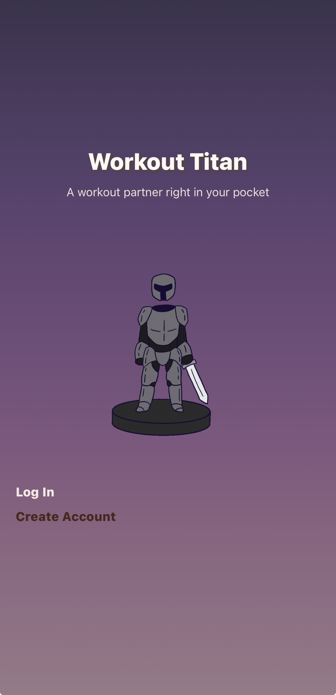
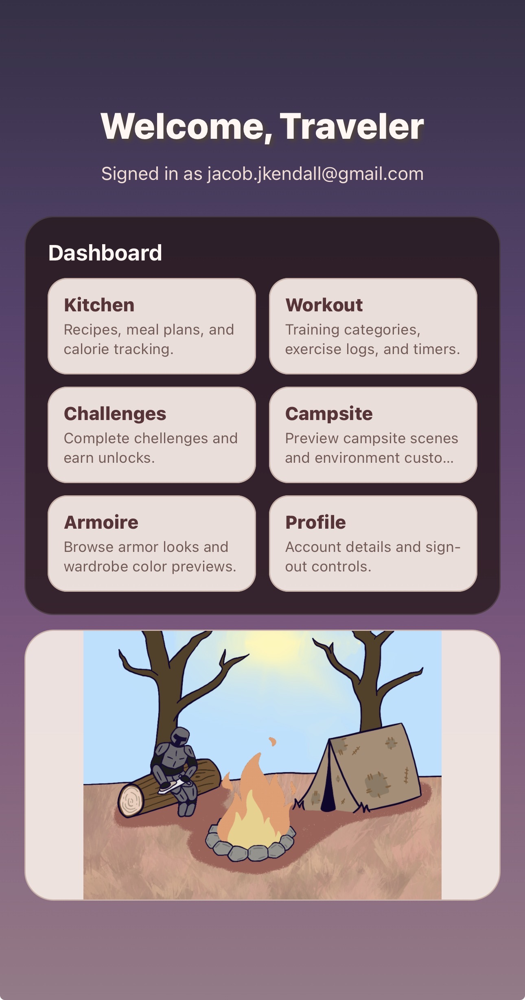
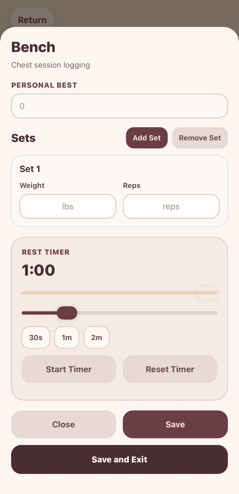
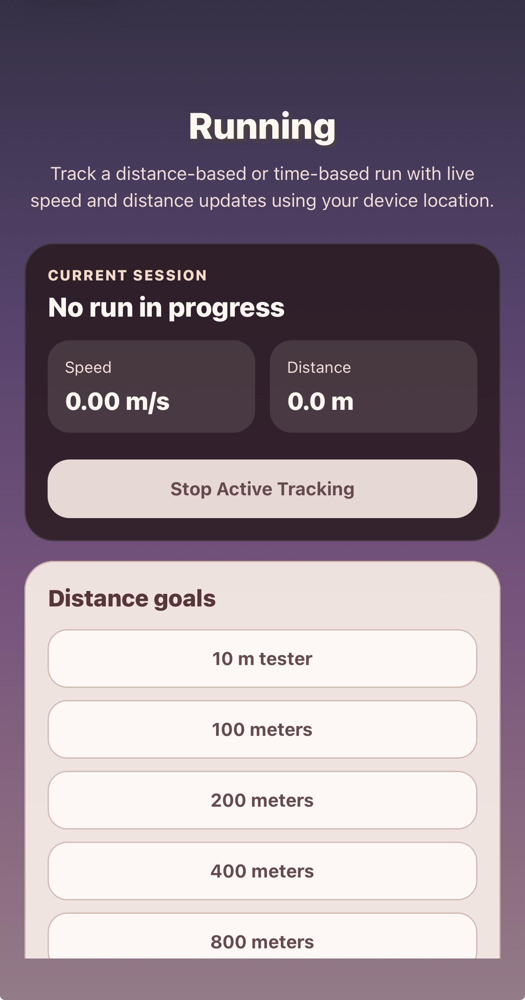
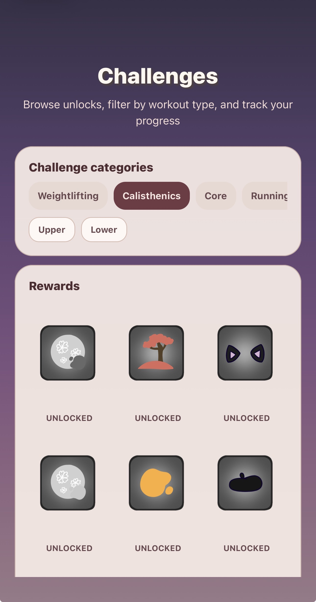

# ⚔️ Workout Titan

Workout Titan is a fantasy-themed fitness application designed to motivate users through gamification. Users can track workouts, complete GPS-based running activities, and earn rewards that can be used to customize their in-game knight.

> **Project Status:** Academic Capstone Project  
> **Platform:** React Native / Expo  
> **Project Type:** Team Project

Workout Titan was developed as a team capstone project. My primary contributions focused on user authentication, workout tracking, GPS-based running, the gamified reward system, and integration with Firebase services.

---

## 📱 Screenshots

### Authentication & Dashboard

  
  

### Workout & Running

  
  

### Rewards

  

---

## ✨ Features

- User registration and login using Firebase Authentication
- Workout activity tracking
- Custom workout presets
- Static workout routines that users can complete and log
- GPS-based running tracking
- Distance-based running goals
- Time-based running goals
- Live running distance and speed tracking
- Automatic run completion when a selected goal is reached
- Gamified reward system
- Unlockable items for the player's knight
- Fantasy-themed progression system
- Workout and activity data stored using Firebase Firestore

---

## 🛠️ Technologies

### Frontend

- React Native
- Expo
- JavaScript
- Expo Router

### Backend & Data

- Firebase Authentication
- Firebase Firestore

### Device APIs

- Expo Location

### Development Tools

- Git
- GitHub
- Visual Studio Code
- npm

---

## 👨‍💻 My Contributions

Workout Titan was developed as a team project. My primary development responsibilities included authentication, workout functionality, GPS-based running, and the application's gamification system.

### Authentication

- Implemented user registration and login functionality.
- Integrated Firebase Authentication for account creation and authentication.
- Implemented authentication state handling throughout the application.

### Workout System

- Developed workout tracking functionality.
- Implemented workout activity logging.
- Created functionality for users to select and complete workout presets.
- Integrated completed workout activities with Firebase Firestore.

### GPS Running

- Implemented GPS-based running using Expo Location.
- Used continuous location updates to track a user's movement during a run.
- Implemented distance-based and time-based running goals.
- Added live distance and speed tracking.
- Filtered inaccurate GPS readings before using location data.
- Implemented location smoothing to reduce GPS position fluctuations.
- Calculated distance traveled from successive GPS coordinates.
- Automatically completed runs when the selected distance or time goal was reached.
- Displayed final run statistics including elapsed time and average speed.

### Gamification & Rewards

- Developed the reward system used to motivate users through progression.
- Implemented reward unlocking based on workout activity.
- Integrated customizable reward items into the fantasy-themed progression system.
- Contributed to the system used to reward players with items for their knight.

### Firebase / Data Integration

- Integrated application features with Firebase Firestore.
- Used authenticated user IDs to associate workout and activity data with individual users.
- Worked with Firestore Security Rules to restrict users to their own data.

---

## 🏗️ Architecture

Workout Titan uses a React Native frontend built with Expo, with Firebase providing authentication and cloud data storage.

~~~text
                    Workout Titan
                         │
                 React Native / Expo
                         │
          ┌──────────────┼──────────────┐
          │              │              │
          ▼              ▼              ▼
   Firebase Auth    Firestore      Expo Location
          │              │              │
          │              │              ▼
          │              │       GPS Run Tracking
          │              │
          └──────────────┴───────► User Activity
~~~

### Authentication

Firebase Authentication handles user registration and login.

~~~text
User
 │
 ▼
React Native
 │
 ▼
Firebase Authentication
 │
 ▼
Authenticated User UID
~~~

### User Data

Workout and activity information is stored in Firestore under the authenticated user's UID.

~~~text
users/
 └── {userId}/
      ├── recipes/
      ├── workoutActivity/
      ├── mealPlans/
      ├── exercises/
      └── cardio/
~~~

Firestore Security Rules ensure that authenticated users can only access data associated with their own user ID.

### GPS Running

The running system uses the device's location services to periodically receive GPS coordinates.

~~~text
Device GPS
    │
    ▼
Expo Location
    │
    ▼
Location Updates
    │
    ├── Accuracy Filtering
    │
    ├── Location Smoothing
    │
    └── Distance Calculation
             │
             ▼
      Distance / Speed
             │
             ▼
       Run Completion
~~~

Distance-based runs automatically complete when the selected distance goal is reached. Timed runs use an elapsed-time tracker to determine when the selected time goal has been completed.

---

## 🚀 Getting Started

### Prerequisites

To run Workout Titan locally, you will need:

- Node.js
- npm
- Expo
- An Android emulator, iOS simulator, or compatible physical device
- A Firebase project configured for the application

### Installation

Clone the repository:

~~~bash
git clone https://github.com/JacobKendall-dev/WorkoutTitan.git
~~~

Navigate into the project:

~~~bash
cd WorkoutTitan
~~~

Install dependencies:

~~~bash
npm install
~~~

Start the Expo development server:

~~~bash
npx expo start
~~~

The application can then be opened using an Android emulator, iOS simulator, or compatible physical device.

### Firebase Configuration

Workout Titan uses Firebase Authentication and Firestore.

To run your own instance of the application, configure a Firebase project and provide the appropriate Firebase client configuration.

> **Note:** The original application was developed as a team academic project and uses project-specific Firebase services. A developer setting up their own instance should configure their own Firebase project and security rules.

---

## 🔐 Security

Workout Titan uses Firebase Authentication to identify users and Firestore Security Rules to restrict access to user-specific data.

The application's Firestore rules require an authenticated user and verify that the authenticated user's UID matches the UID associated with the requested data.

This prevents users from directly accessing another user's workout and activity data through the client.

---

## ⚠️ Known Issues

Workout Titan is an academic capstone project and is not currently intended to be considered a production-ready application.

Known limitations include:

- Some reward unlock states do not persist correctly.
- The knight inventory system is partially implemented.
- Some knight customization state does not persist consistently between screens.
- Parts of the character customization system were left incomplete during the team development process.
- Additional testing and error handling would be needed for a production release.

---

## 🔮 Future Improvements

Potential future improvements include:

- Complete persistent knight inventory functionality.
- Improve reward persistence and progression.
- Complete persistent knight equipment customization.
- Expand workout customization options.
- Add additional workout and cardio activities.
- Improve GPS tracking accuracy and background tracking.
- Add automated unit and integration testing.
- Improve application state management.
- Improve UI/UX consistency.
- Add additional gamification and progression features.
- Improve offline handling and synchronization.
- Prepare the application for production deployment.

---

## 📚 Project Context

Workout Titan was created as a university capstone project and was developed collaboratively with a team.

The project provided experience with:

- Mobile application development
- React Native and Expo
- Firebase Authentication
- Cloud Firestore
- Device location APIs
- User authentication and authorization
- Git-based collaborative development
- Application state management
- Gamification and progression systems
- Team-based software development

The project also provided experience working with an existing codebase and integrating independently developed features into a larger application.